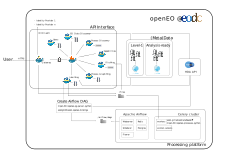

# openEO EODC Driver


- openEO version: 1.0.x (currently in development)
- openEO version: 0.4.2 (legacy, see openeo-openshift-driver [tag v1.1.2](https://github.com/Open-EO/openeo-openshift-driver/releases/tag/v1.1.2))



## Information

This repository contains a fully dockerized implementation of the openEO API (openeo.org), written in Python. The web
app implementation is based on Flask, while openEO functionalities are implemented as micro-services with Nameko.

Additionally, three docker-compose files implement a CSW server for data access (`/csw`), an Apache Airflow workflow management platform coupled to a Celery cluster for data processing (`/airflow`), and UDF Services for the R and Python languages (`/udf`). The whole setup can be installed on a laptop to simplify development, but each service can run on independent (set of) machines.

## Start the API

In order to start the API web app and its micro-services, a simple docker-compose up is needed. However some environment variables must be set first.

#### Configuration

First some environment variable need to be set.

Copy the `sample.env` file and the `/sample-envs` folder to to `.env` and `/envs`, respectively. The latter are
included in the `.gitignore` by default. Do not change this. Variables in the `.env`file are used in
`docker-compose.yml` when bringing up the project, while variables in the individual env files in `/envs` are available
within each respective container. The following is the list of files to update.

It should be mentioned that most of the env variables are prefixed with `OEO_` those variables are used by
[dynaconf](https://dynaconf.readthedocs.io/en/latest/index.html) - the configuration management tool we use. The env
variables which are not prefixed are used outside of Python and are directly accessed as environment variables without
prior validation.

- `.env` : note that you MUST create manually the folder specified for 'LOG_DIR'
- `envs/csw.env`
- `envs/data.env`
- `envs/gateway.env`
- `envs/jobs.env`
- `envs/files.env`
- `envs/processes.env`
- `envs/pycsw.env`
- `envs/rabbitmq.env`
- `envs/users.env`

Then also copy `/gateway/gateway/sample_openapi.yaml` file to `/gateway/gateway/openapi.yaml` and edit `servers` and
`info` sections, adding your urls, name and some description.

#### Bring up web app and services

For local development, you will need a docker network shared across the API, CSW and Airflow setups. Create one like this:

```
docker network create openeo-v1.0
```

Leave the name as is or update in the docker-compose_dev.yml files for the API, CSW and Airflow.

From the main folder, run the following command:

```
docker-compose -f docker-compose.yml -f docker-compose_dev.yml up -d
```

The `docker-compose_dev.yml` file is identical to `docker-compose.yml`, but additionally exposes some ports and assigns the containers to the docker network created above.
Additionally, the bash functions in `dev_openeo_sample` can be used (after filling in the relevant fields) to start the services (Nameko) or the gateway (Flask) locally without Docker containers. In this case one can use breakpoints to debug.


#### Set up all databases with Alembic

A number of databases are set up with Alembic, namely one for users, one for process graphs and one for jobs. Make sure that the API is up and run the following command to initialize all databases:

```
bash init_dbs.sh
```

#### Add admin user

At least one admin user must exist in the users database, to allow using the API functionalities via the endpoints. This user must be added manually to the database. In order to do so, you need to connecto to the gateway container and run a sequence of commands.

```
docker exec -it openeo-users-db bash
```

Once in the container, connect to the database:

```
psql -U $OEO_DB_USER -p $OEO_DB_PORT -h localhost $OEO_DB_NAME
```

Before adding user, user profiles must be inserted as well as identity providers (for OpenIDConnect).

The following create two user profiles (`profile_1`, `profile_2`), with different data access. The specific profile name and fields in the data access depend on the implementation.

```
insert into profiles (id, name, data_access) values ('pr-19144eb0-ecde-4821-bc8b-714877203c85', 'profile_1', 'basic,pro');
insert into profiles (id, name, data_access) values ('pr-c36177bf-b544-473f-a9ee-56de7cece055', 'profile_2', 'basic');
```

Identity providers can be added with the following command:

```
insert into identity_providers (id, id_openeo, issuer_url, scopes, title, description) values ('ip-c462aab2-fdbc-4e56-9aa1-67a437275f5e', 'google', 'https://accounts.google.com', 'openid,email', 'Google', 'Identity Provider supported in this back-end.');
```

Finally, users can be added to the users database. In order to add a user for Basic auth, one first needs to create a hashed password. Execute the following in a Python console.

```
from passlib.apps import custom_app_context as pwd_context
print(pwd_context.encrypt("my-secure-password"))
```

Then back on the database command line, run the following replacing `hash-password-goes-here` with the output of the previous command (leave it wrapped in single quotes):

```
insert into users (id, auth_type, role, username, password_hash, profile_id, created_at, updated_at) values ('us-3eb63b58-9a04-4098-84d7-xxxxxxxxxxxx', 'basic', 'admin', 'my-username', 'hash-password-goes-here', 'pr-c36177bf-b544-473f-a9ee-56de7cece055', '2019-12-18 10:45:18.000000', '2019-12-18 10:45:18.000000');
```

A user for Basic auth with admin rights is now inserted in the database. Note that the  `profile_id` matches the one of `profile_2` above.

The following command creates a user with admin rights for OpenIDConnect auth:

```
insert into users (id, auth_type, role, email, profile_id, identity_provider_id, created_at, updated_at) values ('us-3eb63b58-9a04-4098-84d7-yyyyyyyyyyyy', 'oidc', 'admin', 'my.email@gmail.com', 'pr-19144eb0-ecde-4821-bc8b-714877203c85', 'ip-c462aab2-fdbc-4e56-9aa1-67a437275f5e', '2019-12-18 10:45:18.000000', '2019-12-18 10:45:18.000000');
```

Note that the `identity_provider_id` matches the only one created above, and the `profile_id` matches the one of `profile_1` above.


#### Add collections and processes

Currently, no collection and no process are available yet at the endpoints `/collections` and `/processes`.

Copy the `sample-auth` file to `auth` and fill the back-end URL and user credential (user with admin rights). Then run the following to add collections (sourced from the CSW server) and processes to the back-end:

```
source auth
python api_setup.py
```

#### Bring down web app and services

In order to bring down the API, run the following docker compose from the main folder:

```
docker-compose down
```

## Tests

For development we provide a set of tests including unittests, linting and static type checking. Find more details
[here](https://github.com/Open-EO/openeo-openshift-driver/blob/master/doc/run_tests.md).
